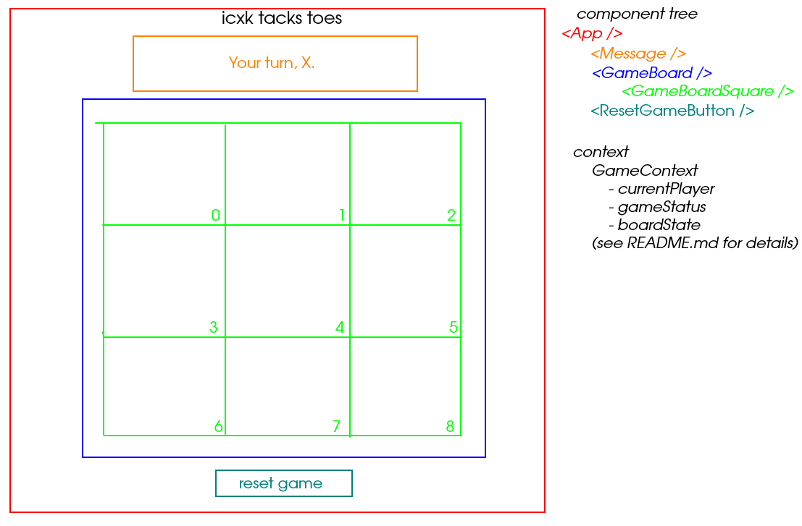

# Tic Tac Toe

It's two-player tic tac toe that you can play in your browser

## Wireframe

## Components
- `App`
  - `Message` - Displays message to players telling them whose turn it is, as well as when win/lose/tie happens
  - `GameBoard` - Component containing game board itself, contains nine `GameBoardSquare`s
    - `GameBoardSquare` - Square on board, can display an X, an O, or nothing
  - `ResetGameButton` - resets game and all components to initial state

### Component functions
#### Message
- `setMessage()` - sets user-facing message to whatever it needs to be, based on `currentPlayer` and `gameStatus`

## State
### Context
#### Data
- `GameContext` - contains all state information on game (listed below)
    - `currentPlayer` - [string] - whose turn it is 
    - `gameStatus` - [string] - whether X or O has won/tied, set to `running` if game is running, otherwise `Xwin`, `Owin`, or `tie`
    - `boardState` - [array, 9 objects] - state of game board, see wireframe for which id maps to which board square
        - Object structure:
            - `ClaimedBy`: possible values: `X`, `O`, or `""` for neither
            - `id`: which spot on the board--see diagram

#### Functions
- `checkForGameEnd()` - checks if board state is a win/loss/tie, updates `gameStatus` if appropriate to do so, called after each player move
- `claimByPlayer(squareId)` - triggered by clicking on square: swaps `currentPlayer`, updates `boardState`, checks for game end
- `resetGame()` - triggered by clicking on reset game button; randomizes `currentPlayer`, blanks out `boardState`, sets `gameStatus` to `running`
